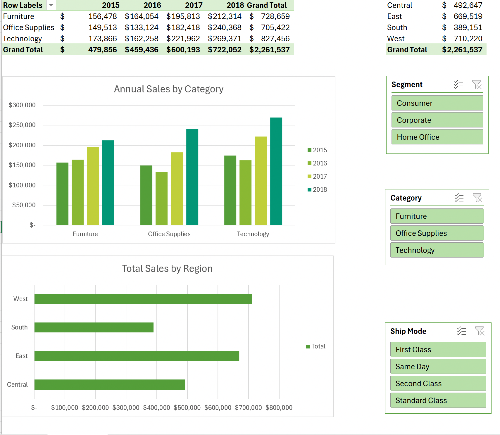

# 📊 Interactive Sales Performance Dashboard (Microsoft Excel)

An interactive, single-page sales analytics dashboard built with **Microsoft Excel**. This project visualizes retail sales data across product categories, geographic regions, customer segments, and order shipment modes to provide actionable business insights.

---

## 🎯 Project Overview

The primary objective of this project is to transform raw sales records into an intuitive visual report. It allows stakeholders to analyze total sales distribution, evaluate category-level performance over time, and filter key metrics dynamically without navigating complex spreadsheets.

---

## 🛠️ Key Features & Technical Workflows

* **Data Transformation (Power Query):** Cleaned raw datasets, calculated key date fields, and structured data tables for efficient aggregation.
* **PivotTable Aggregates:** Built summary metrics to calculate overall revenue, yearly category performance, and regional sales breakdowns.
* **Dynamic Slicers:** Connected cross-filtering Slicers for **Segment**, **Category**, and **Ship Mode** to update all visuals simultaneously.
* **Custom Data Visualization:** Designed clustered column charts and horizontal bar graphs aligned to a clean, grid-free visual interface.
* **Cohesive Visual Theme:** Applied a custom corporate color palette with structured alignment for optimal executive readability.

---

## 📂 Repository Structure

* `train.csv` : Raw sales dataset
* `Train.xlsx` : Interactive Excel Dashboard file (PivotTables & Slicers)
* `excel-screenshot-1.jpg` : Dashboard visual preview
* `README.md` : Project documentation

---

## 💡 Key Business Insights

* **Category Growth:** Technology and Furniture categories drive the highest revenue share, with consistent year-over-year sales growth across all regions.
* **Geographic Distribution:** West and East regions generate the highest sales volume compared to Central and South territories.
* **Shipping & Customer Behavior:** The **Consumer** segment represents the largest order volume, with **Standard Class** being the predominant shipping method.

---

## 🚀 How to Use

1. Clone or download this repository.
2. Open `Train.xlsx` in Microsoft Excel.
3. Interact with the **Slicers** on the `Pivot_Report` tab to slice and dice the data dynamically.
